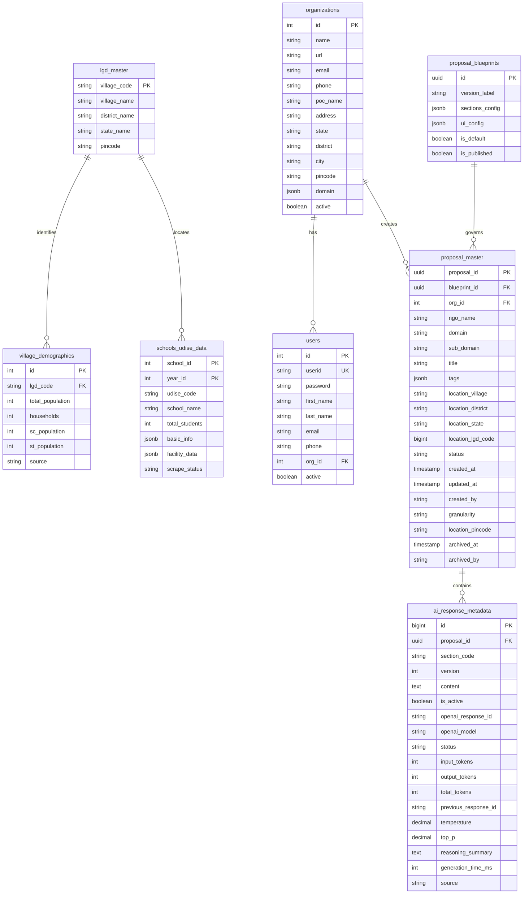

# Prakalpa Proposal Database

This repository contains the database initialization scripts for the Prakalpa Proposal application.

## Contents
- `init.sql`: Main entry point for PostgreSQL initialization.
- `scripts/`: Python and Shell scripts for the "Foundation Data" strategy (Geography, Demographics, and Amenities).
- `data/`: Local storage for processed datasets.

## 📊 Database Schema

The system follows a **Foundation Data** strategy, pre-populating geography and social infrastructure intelligence:

**Core Persistence:**
- `proposal_master` - Session tracking with `org_id` ownership, `title` identity, `blueprint_id` pinning, `location_pincode` persistence, and Lifecycle audit fields (`archived_at`).
- `proposal_blueprints` - Dynamic configuration storage for section dependencies, UI layout, and LLM parameters.
- `ai_response_metadata` - Versioned AI content and Manual Drafts with `source` tracking (AI vs User).

**Foundation Data:**
- `lgd_master` - Authoritative geography master (Village to State) from data.gov.in.
- `village_demographics` - SC/ST population and household stats from NDAP/JJM.
- `schools_udise_data` - **Authoritative Sync**: Flattened UDISE+ school index with enrollment and infrastructure (Integrated Year 12).
- `village_amenities_raw` - Massive dataset (150+ columns) for village-level infrastructure gaps (NDAP 7121).

**Domain Data Summary:**
- `jjm_population_data` - Population data from Jal Jeevan Mission.
- `schools_udise_data` - Detailed school infrastructure and enrollment metrics (In-Sync).


## 🚀 Data Foundation Setup

Before generating proposals, you must initialize the geographic and demographic foundation:

1. **Initialize LGD Hierarchy**:
   ```bash
   cd scripts
   python fetch_lgd_master.py  # Fetches latest geography from LGD API
   ```

2. **Ingest NDAP Demographics**:
   ```bash
   # Ingest National Data Analytics Platform statistics
   python ingest_ndap_9307.py
   ```

3. **UDISE+ Multi-State Sync (Two-Pass Registry)**:
   ```bash
   cd scripts
   # Pass 1: Discovery (List all schools)
   python discover_registry.py --state KARNATAKA
   
   # Pass 2: Deep Mining (Enrich infrastructure & student logs)
   python enrich_registry.py --state KARNATAKA
   ```

4. **Master Setup**:
   Refer to `./scripts/setup_data.sh` or `./scripts/sequence_orchestrator.sh` for automated multi-state mining.

## Usage
This file is mounted to `/docker-entrypoint-initdb.d/init.sql` in the Postgres Docker container.

## Schema Diagram

