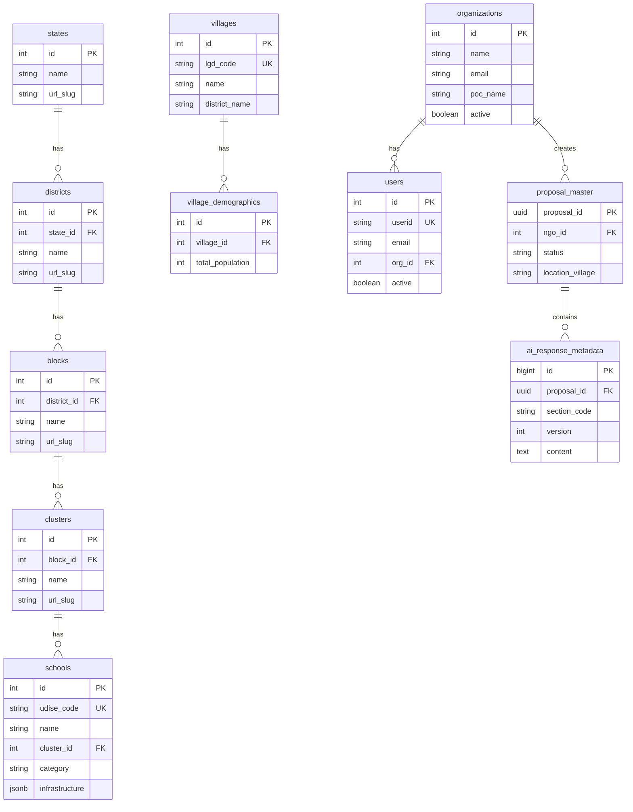

# Prakalpa Proposal Database

This repository contains the database initialization scripts for the Prakalpa Proposal application.

## Contents
- `init.sql`: Main entry point for PostgreSQL initialization. Creates tables and default data.

## Usage
This file is mounted to `/docker-entrypoint-initdb.d/init.sql` in the Postgres Docker container.

## Schema Diagram

