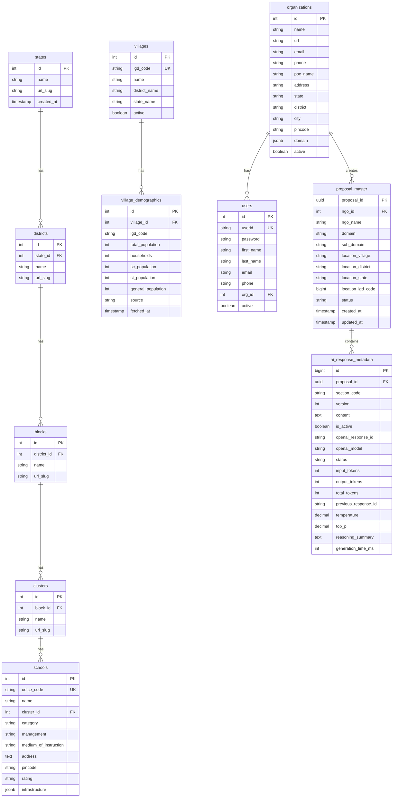

# Prakalpa Proposal Database

This repository contains the database initialization scripts for the Prakalpa Proposal application.

## Contents
- `init.sql`: Main entry point for PostgreSQL initialization. Creates tables and default data.

## 📊 Database Schema

The system uses PostgreSQL with the following main tables:

**Core Persistence:**
- `proposal_master` - Top-level session tracking for proposals
- `ai_response_metadata` - Stores every AI generation (versioned) with token usage and context chaining

**Domain Data:**
- `states` - Indian states
- `districts` - Districts within states
- `blocks` - Administrative blocks
- `clusters` - School clusters
- `schools` - Individual school records with demographic data
- `jjm_population_data` - Population data from Jal Jeevan Mission

## Usage
This file is mounted to `/docker-entrypoint-initdb.d/init.sql` in the Postgres Docker container.

## Schema Diagram

