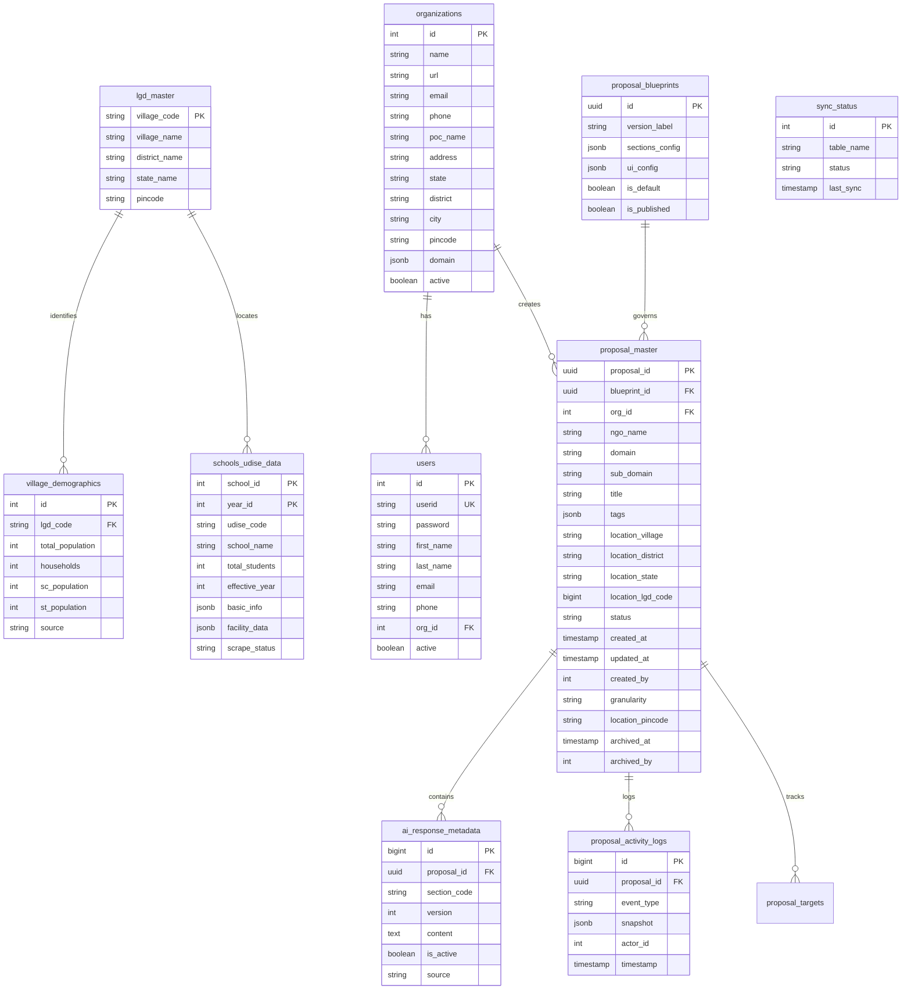

[← Back to Main README](../README.md)

# Prakalpa Proposal Database

This repository contains the database initialization scripts for the Prakalpa Proposal application.

## Contents
- `init.sql`: Main entry point for PostgreSQL initialization.
- `scripts/`: Python and Shell scripts for the "Foundation Data" strategy (Geography, Demographics, and Amenities).
- `data/`: Local storage for processed datasets.

## 📊 Database Schema

The system follows a **Foundation Data** strategy, pre-populating geography and social infrastructure intelligence:

**Core Persistence:**
**Core Persistence:**
- `proposal_master` - Session tracking with `org_id` ownership, `title` identity, `blueprint_id` pinning, `location_pincode` persistence, and Lifecycle audit fields (`archived_at`).
- `proposal_blueprints` - Dynamic configuration storage for section dependencies, UI layout, and LLM parameters.
- `ai_response_metadata` - Versioned AI content and Manual Drafts with `source` tracking (AI vs User).
- `proposal_targets` - Specific impact targets and beneficiary metrics for individual proposals.

**Governance & Lifecycle:**
- `proposal_activity_logs` - **Forensic Audit Trail**: Immutable write-time freezing of proposal state, actor context, and event metadata.
- `sync_status` - Tracking for background data ingestion jobs (UDISE, JJM, LGD).
- `ngo_onboarding_requests` / `ngo_join_requests` - Management of organization lifecycle and user access petitions.
- `users` / `organizations` - RBAC-base identity and organizational multi-tenancy.

**Foundation Data & Domain Intelligence:**
- `lgd_master` - Authoritative geography master (Village to State) providing the primary hierarchical anchors.
- `schools_udise_data` - **Authoritative Sync**: Detailed school infrastructure and enrollment metrics (In-Sync with LGD geography).
- `village_demographics` - SC/ST population and household stats from NDAP/JJM.
- `village_amenities_raw` - Detailed indicators for village-level infrastructure gaps (NDAP 7121).
- `jjm_population_data` - Augmented population metrics from Jal Jeevan Mission.


## 🚀 Data Foundation Setup

Before generating proposals, you must initialize the geographic and demographic foundation:

1. **Initialize LGD Hierarchy**:
   ```bash
   cd scripts
   python fetch_lgd_master.py  # Fetches latest geography from LGD API
   ```

2. **Ingest NDAP Demographics**:
   ```bash
   # Ingest National Data Analytics Platform statistics
   python ingest_ndap_9307.py
   ```

3. **UDISE+ Multi-State Sync (Two-Pass Registry)**:
   ```bash
   cd scripts
   # Pass 1: Discovery (List all schools)
   python discover_registry.py --state KARNATAKA
   
   # Pass 2: Deep Mining (Enrich infrastructure & student logs)
   python enrich_registry.py --state KARNATAKA
   
   # Optional: Recovery Mode (Probe previous academic years if current data is absent)
   python enrich_registry.py --state KARNATAKA --mode recovery
   ```

4. **Master Setup**:
   Refer to `./scripts/setup_data.sh` or `./scripts/sequence_orchestrator.sh` for automated multi-state mining.

## Usage
This file is mounted to `/docker-entrypoint-initdb.d/init.sql` in the Postgres Docker container.

## Schema Diagram

```mermaid
erDiagram
    lgd_master ||--o{ village_demographics : "identifies"
    lgd_master {
        string village_code PK
        string village_name
        string district_name
        string state_name
        string pincode
    }

    lgd_master ||--o{ schools_udise_data : "locates"
    schools_udise_data {
        int school_id PK
        int year_id PK
        string udise_code
        string school_name
        int total_students
        int effective_year
        jsonb basic_info
        jsonb facility_data
        string scrape_status
    }

    village_demographics {
        int id PK
        string lgd_code FK
        int total_population
        int households
        int sc_population
        int st_population
        string source
    }

    organizations ||--o{ users : "has"
    organizations {
        int id PK
        string name
        string url
        string email
        string phone
        string poc_name
        string address
        string state
        string district
        string city
        string pincode
        jsonb domain
        boolean active
    }

    users {
        int id PK
        string userid UK
        string password
        string first_name
        string last_name
        string email
        string phone
        int org_id FK
        boolean active
    }

    proposal_blueprints ||--o{ proposal_master : "governs"
    proposal_blueprints {
        uuid id PK
        string version_label
        jsonb sections_config
        jsonb ui_config
        boolean is_default
        boolean is_published
    }

    organizations ||--o{ proposal_master : "creates"
    proposal_master ||--o{ ai_response_metadata : "contains"
    proposal_master {
        uuid proposal_id PK
        uuid blueprint_id FK
        int org_id FK
        string ngo_name
        string domain
        string sub_domain
        string title
        jsonb tags
        string location_village
        string location_district
        string location_state
        bigint location_lgd_code
        string status
        timestamp created_at
        timestamp updated_at
        int created_by
        string granularity
        string location_pincode
        timestamp archived_at
        int archived_by
    }

    ai_response_metadata {
        bigint id PK
        uuid proposal_id FK
        string section_code
        int version
        text content
        boolean is_active
        string source
    }

    proposal_activity_logs {
        bigint id PK
        uuid proposal_id FK
        string event_type
        jsonb snapshot
        int actor_id
        timestamp timestamp
    }

    proposal_master ||--o{ proposal_activity_logs : "logs"
    proposal_master ||--o{ proposal_targets : "tracks"
    
    sync_status {
        int id PK
        string table_name
        string status
        timestamp last_sync
    }
```
